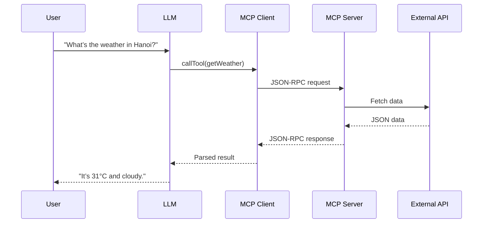

If you’ve been experimenting with OpenAI’s **Agent SDK**, **Codex Cloud**, or even building your own tools for ChatGPT or Cursor, you’ve likely encountered the term **MCP (Model Context Protocol)**.  
It’s the protocol that allows a model (like GPT-5) to talk to your backend server as if it were a human developer — seamlessly, intelligently, and safely.

Let’s break down what MCP really is, how it uses **JSON-RPC** as its backbone, and why it’s essentially a **backend for LLMs**, not humans.

---

## 1. What Is JSON-RPC?

Before MCP, you need to understand its foundation: **JSON-RPC 2.0** — a lightweight, language-agnostic communication protocol.

Every request is a simple JSON object:

```json
{
  "jsonrpc": "2.0",
  "method": "getWeather",
  "params": { "city": "Hanoi" },
  "id": 1
}
```

And every response follows the same pattern:

```json
{
  "jsonrpc": "2.0",
  "result": { "temp": 31, "condition": "Cloudy" },
  "id": 1
}
```

If something goes wrong:

```json
{
  "jsonrpc": "2.0",
  "error": { "code": -32601, "message": "Method not found" },
  "id": 1
}
```

It’s **stateless**, **structured**, and **perfect for machine-to-machine conversations** — exactly what an LLM needs when calling tools or APIs.

---

## 2. MCP = “Backend for LLMs”

At its core, an **MCP server** is just a backend service that exposes a set of methods (called **tools**) via JSON-RPC.  
But the key difference is the **audience**:

| Aspect | Traditional Backend | MCP Server |
|--------|----------------------|-------------|
| **Client** | Human apps (frontend, mobile) | AI models (GPT, Codex, Claude) |
| **Protocol** | REST / GraphQL | JSON-RPC |
| **Schema** | OpenAPI / Swagger | `manifest.json` |
| **Response** | For UI rendering | For reasoning / code generation |
| **Consumer** | Developer | Language model |

Think of it this way:  
> REST APIs serve *humans and UI*; MCP APIs serve *AI and reasoning*.

---

## 3. Anatomy of an MCP Server

A typical project structure might look like this:

```md
apps/mcp-server
├── adapters/           # Data access logic (DB, external APIs)
│   ├── weather.adapter.ts
│   ├── googlemaps.adapter.ts
├── tools/              # Tool definitions (the callable methods)
│   ├── getWeather.tool.ts
│   ├── getPlaces.tool.ts
├── manifest.json       # Describes available tools & schemas
├── router.ts           # Handles JSON-RPC routing
└── main.ts             # Server entry point (Express/Fastify)
```

### Minimal example

```ts
// main.ts
import express from 'express';
import bodyParser from 'body-parser';
import { handleRequest } from './router';

const app = express();
app.use(bodyParser.json());

app.post('/mcp', async (req, res) => {
  const response = await handleRequest(req.body);
  res.json(response);
});

app.listen(4000, () => console.log('MCP server on :4000'));
```

```ts
// router.ts
import { getWeather } from './tools/getWeather';

export async function handleRequest(req: any) {
  if (req.method === 'getWeather') {
    return { jsonrpc: '2.0', result: await getWeather(req.params), id: req.id };
  }
  return { jsonrpc: '2.0', error: { code: -32601, message: 'Method not found' }, id: req.id };
}
```

---

## 4. The Role of `manifest.json`

This file is the **bridge between your backend and the LLM**.  
It tells the model:
> “Here are the tools I provide, what inputs they expect, and what outputs they return.”

Example:

```json
{
  "schema_version": "v1",
  "name_for_model": "weather_places_api",
  "description_for_model": "Provides weather and nearby place data.",
  "tools": [
    {
      "name": "getWeather",
      "description": "Get weather by city name",
      "input_schema": {
        "type": "object",
        "properties": { "city": { "type": "string" } },
        "required": ["city"]
      },
      "output_schema": {
        "type": "object",
        "properties": {
          "tempC": { "type": "number" },
          "condition": { "type": "string" }
        }
      }
    }
  ]
}
```

It’s conceptually equivalent to **OpenAPI/Swagger**, but for **LLM consumption** —  
machine-readable, semantically descriptive, and automatically discoverable by Codex Cloud, ChatGPT Agents, or VSCode’s MCP client.

---

## 5. Example: Figma MCP Server

When ChatGPT says: *“Generate React code from my Figma design”*,  
here’s what actually happens:

1. The MCP client sends a JSON-RPC request:
   ```json
   { "method": "getDesignComponents", "params": { "fileId": "abc123" } }
   ```
2. The MCP server queries Figma’s API, transforms the raw design data into structured JSON:
   ```json
   {
     "components": [
       {
         "name": "Primary Button",
         "props": { "text": "Submit" },
         "styles": { "backgroundColor": "#2563EB", "textColor": "#FFFFFF" }
       }
     ]
   }
   ```
3. The LLM receives this JSON, recognizes it as a *UI description*, and renders it into React:
   ```tsx
   <Button className="bg-blue-600 text-white rounded-md">Submit</Button>
   ```

💡 The magic isn’t in the server — it’s in how the LLM **interprets structured data semantically** to produce usable output.

---

## 6. JSON-RPC Flow in Context



---

## 7. MCP vs REST – A Mental Model

| Concept | REST API | MCP Server |
|----------|-----------|-------------|
| **Endpoint** | `/api/weather` | `"method": "getWeather"` |
| **Spec File** | `openapi.json` | `manifest.json` |
| **Request Protocol** | HTTP verbs | JSON-RPC calls |
| **Client** | Browser / App | LLM / Agent |
| **Goal** | Deliver data | Deliver context for reasoning |
| **Human-facing** | ✅ | ❌ |
| **Model-facing** | ❌ | ✅ |

👉 In other words:  
**REST** helps developers talk to servers.  
**MCP** helps *models* talk to servers.

---

## 8. Putting It All Together

MCP is the **standard API contract for AI agents**.  
It lets you expose your data, logic, or services as *tools* that a model can reason about — without needing to handcraft prompts or deal with REST auth tokens.

### You can think of it like this:
> 🔹 `manifest.json` = OpenAPI spec  
> 🔹 JSON-RPC = HTTP transport layer  
> 🔹 LLM reasoning = “semantic client” that consumes it

And together, they form a **new generation of developer interface**, where code, data, and AI collaborate natively.

---

## 9. Key Takeaways

- **MCP servers are backends for AI**, not for humans.  
- **manifest.json** = “Swagger for LLMs”.  
- **JSON-RPC** = minimal transport, perfect for reasoning loops.  
- LLMs can read structured JSON and turn it into actions, code, or insights.  
- The MCP ecosystem (Codex Cloud, VSCode MCP, Agent SDK) is redefining how we build tool-aware AI systems.

---

## 10. Learn More

- [Model Context Protocol (Official)](https://modelcontextprotocol.io)
- [OpenAI Dev Day 2025 – Building Agents and Tools](https://platform.openai.com/agent-builder)
- [JSON-RPC Specification](https://www.jsonrpc.org/specification)
- [Codex Cloud GitHub Examples](https://github.com/openai/modelcontextprotocol)

---

**In short:**  
> REST APIs let humans use data.  
> MCP lets **AI** use your data — safely, semantically, and automatically.
